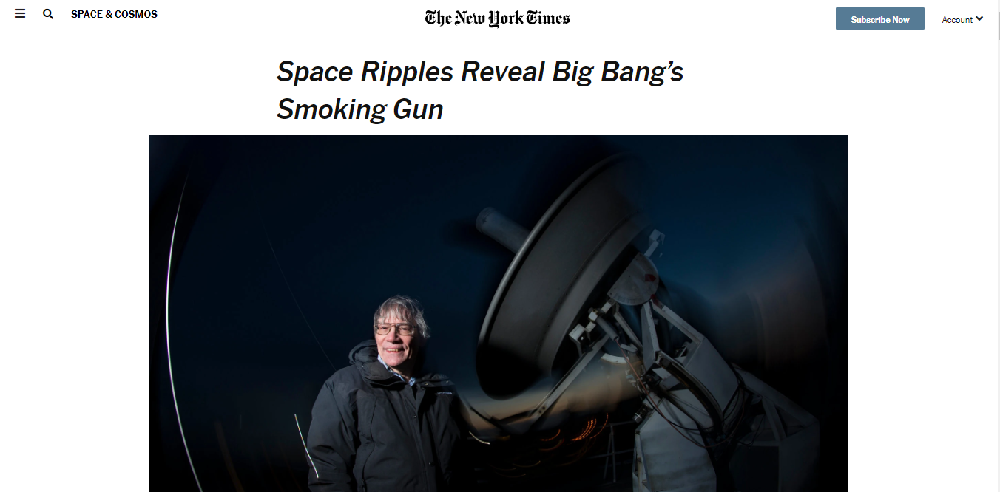
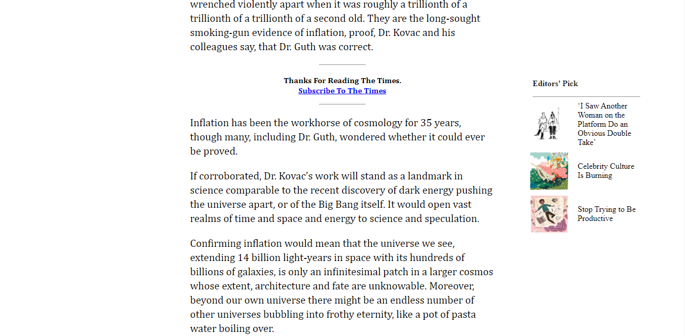

# NEW YORK TIMES CLONE

> A clone of one of New York Times article page.

## Built With

- HTML,
- CSS

## Live Demo

[Live Demo Link](https://raw.githack.com/ebeagusamuel/New-York-Times-Clone/feature-branch/index.html)

To get a local copy up and running follow these simple example steps.

## Authors

👤 **Elijah Ayandokun**

- Github: [@elijahtobs](https://github.com/elijahtobs)
- Twitter: [@elijahgr8](https://twitter.com/twitterhandle)
- Linkedin: [linkedin](https://linkedin.com/in/ayandokunelijah)

👤 **Samuel Ebeagu**

- Github: [@githubhandle](https://github.com/ebeagusamuel)
- Twitter: [@twitterhandle](https://twitter.com/ebeagu_samuel)
- Linkedin: [linkedin](https://www.linkedin.com/in/samuel-ebeagu-7b4617110/)

## 🤝 Contributing

Contributions, issues and feature requests are welcome!

Feel free to check the [issues page](issues/).

## 📝 License

This project is [MIT](lic.url) licensed.
